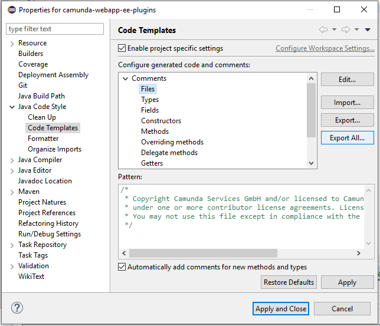

# Type of Licenses

Every java source file needs to contain license header at the begining. Find out more about the different licenses and how to configure your IDE accordigly.

## Apache 2.0 license header

The community repositories are licensed under Apache 2.0. Please find more information in our [Contribution guide](https://github.com/camunda/camunda-bpm-platform/blob/master/CONTRIBUTING.md#license-headers).

```java
/*
 * Copyright Camunda Services GmbH and/or licensed to Camunda Services GmbH
 * under one or more contributor license agreements. See the NOTICE file
 * distributed with this work for additional information regarding copyright
 * ownership. Camunda licenses this file to you under the Apache License,
 * Version 2.0; you may not use this file except in compliance with the License.
 * You may obtain a copy of the License at
 *
 *     http://www.apache.org/licenses/LICENSE-2.0
 *
 * Unless required by applicable law or agreed to in writing, software
 * distributed under the License is distributed on an "AS IS" BASIS,
 * WITHOUT WARRANTIES OR CONDITIONS OF ANY KIND, either express or implied.
 * See the License for the specific language governing permissions and
 * limitations under the License.
 */
 ```

## Commercial license

The repositories licensed under a commercial license are:

* https://github.com/camunda/camunda-bpm-platform-ee
* https://github.com/camunda/camunda-bpm-xslt-ee
* https://github.com/camunda/camunda-license-check

# IDE Setup

## Eclipse

The default license header (Apache 2.0) is setup when the [code templates](https://github.com/camunda/camunda-bpm-platform/tree/master/settings/eclipse)
are imported in Eclipse.

(`TODO:` create code template for ee projects once we updated the current code template with the new code style rules.)

The commercial license header must be setup explicitly for each ee subproject of camunda-bpm-platform-ee, perform the following steps:
1. Select the project. (for example `camunda-webapp-ee-plugins`)
2. Open its `Properties`.
3. Enable the project specific settings
4. Navigate to Comments -> File
5. Change the pattern to the commercial one:
```java
/*
 * Copyright Camunda Services GmbH and/or licensed to Camunda Services GmbH
 * under one or more contributor license agreements. Licensed under a commercial license.
 * You may not use this file except in compliance with the commercial license.
 */
 ```


## IntelliJ IDE

1. Open `Settings` (Ctrl+Alt+S)
2. Navigate to `File and Code Templates`
3. Create two new templates in `Includes` tab - "license-ce" and "license-ee"
4. Change the `Class` file template to:
```
#set ($projectName=${PROJECT_NAME})
#if ($projectName.contains("ee"))
#parse("license-ee.java")
#else
#parse("license-ce.java")
#end
#if (${PACKAGE_NAME} && ${PACKAGE_NAME} != "")package ${PACKAGE_NAME};#end
#parse("File Header.java")
public class ${NAME} {
}
```
The commercial license header will be setup to our projects which contain the `ee` in their name.
