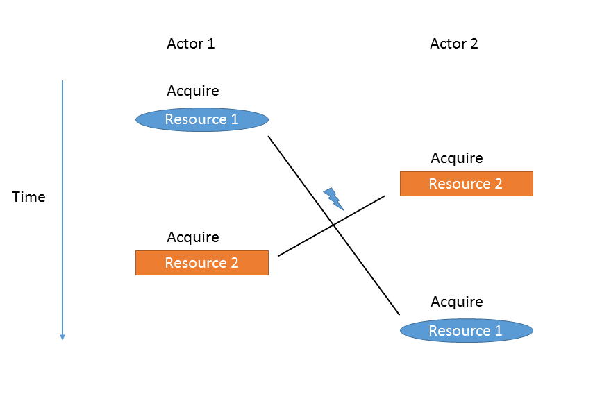

## What is a deadlock?

Two concurrent actors compete for two resources and require lasting, exclusive access to both at the same time. Each actor acquires access to one of the resources and then waits for the other to release the resource that they miss. Neither of the actors is able to make progress unless a third actor resolves the situation.

This scenario can be generalized to any number of actors and resources.

## What are the actors and resources in the context of Camunda and relational databases?

- Actors: Threads/Transactions
- Resources: Locks in the database that are held for the duration of the transaction

### What kinds of locks does a relational database use?

Subject of locks:

- Entire tables
- Single table rows/index entries
- Table/Index ranges

Types of locks:

- Shared/Read Locks: Multiple shared locks can be acquired at the same time, and no exclusive lock
- Exclusive/Write Locks: Only a single exclusive lock can be acquired at the same time, and no shared lock

### When are locks acquired on which transaction isolation level?

This is how it roughly works:

- `READ UNCOMITTED`: Does not involve locks that are held for a duration longer than a single SQL statement
- `READ COMITTED`: Same as `READ UNCOMITTED`, plus: Acquires row-based exclusive locks on modifying SQL statements (`INSERT`, `DELETE`, `UPDATE` statements) that are held until the end of the transaction
- `REPEATABLE READ`: Same as `READ COMMITTED`, plus: Acquires row-based shared locks on reading SQL statements that are held until the end of the transaction
- `SERIABLIZABLE`: Same as `REPEATABLE READ`, plus: Acquires range locks on any range selected by a SQL statement

Every database may handle this differently. Especially snapshot isolation works by different principles and is not covered here.

## Why are deadlocks unlikely to occur in Camunda?

- Camunda requires isolation level `READ_COMMITTED`, so only modifying statements acquire long-lasting exclusive locks
- Camunda commands are separated into two phases, based on the entity cache:
  1. Reading data (`SELECT` statements), applying business logic
  1. Flushing all changes (`INSERT`, `DELETE`, `UPDATE` statements); the flush is made in a canonical order (ordered by entity type and entity id) => That way, locks are only held for a short time and conflicting scenarios are less likely

## Why can a deadlock occur in Camunda?

- The database acquires long-lasting locks on `SELECT` (in particular related to using transaction level `REPEATABLE_READ`)
- The database does not only acquire row locks, but table locks or range locks (on tables or indexes)
- The flush ordering mechanism does not work correctly
- Multiple engine commands are executed in the context of one managed transaction. The engine flushes at the end of every command, so there is no consistent flush order over all those commands.
- The customer runs custom SQL statements on Camunda or their own tables that acquire long-lasting locks out of order.

This list is obviously not exhaustive, but should cover most cases.

## How to find the reason for a concrete deadlock case?

### Checklist:

- Is isolation level `READ_COMMITTED` (or equivalent) used?
- Does the deadlock occur frequently?
- Can it be easily reproduced?
- What are the locks that are acquired in conflicting order?
- Do they run custom statements in the engine transaction?

### Tools for diagnosis:

- Stacktrace: Tells for one of the involved transactions at which point the database resolved the deadlock. This transaction is the one that was cancelled by the database to resolve the deadlock.
- Logging (commands, transactions, SQL statements and flush): Allows to check in which order the engine makes which statement. This gives an indication of the order in which locks are obtained.
- Database diagnostic tools: Most databases keep a log of the deadlocks they detect. This log typically contains details of both transactions that were competing, which locks they held and which they were trying to acquire at the point when the deadlock occurred. It can be a bit hard to trace back the lock identifiers to the corresponding SQL statements.
