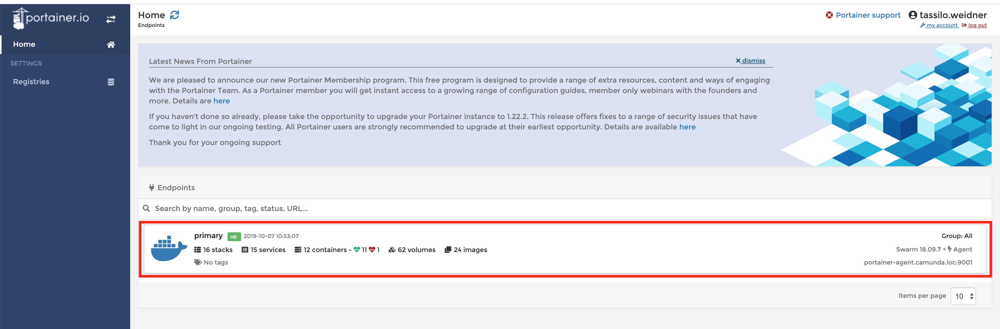
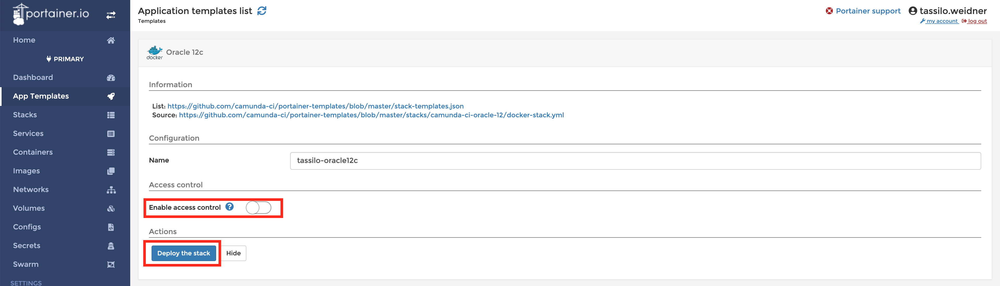
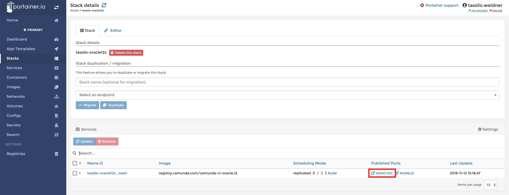
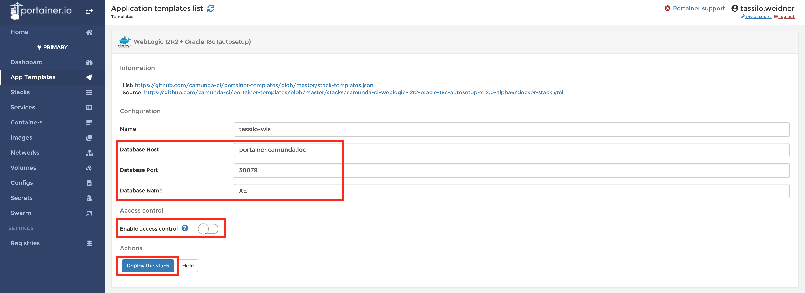

# Auto-setup of Camunda BPM in a Shared Engine Environment

Auto setup templates are available on Portainer to speed up manual testing.
When using these templates, no manual configuration effort is necessary.

This guide documents noteworthy hints to use auto-setup containers on [portainer](http://portainer.camunda.loc:9000/).

## Oracle WebLogic 12R2
### Supported Databases
* Oracle 11g / 12c / 18c

> *Heads-Up:* Please keep in mind that JDBC Batch Processing must be [switched off for Oracle 11g](https://docs.camunda.org/manual/latest/user-guide/process-engine/database/#jdbc-batch-processing).

### Setup
#### Step 1: Go to Portainer
1. Go to Portainer [http://portainer.camunda.loc:9000/](http://portainer.camunda.loc:9000/)
2. Log in with your LDAP credentials
3. Click on the Endpoint "primary"
   

#### Step 2: Create a database container
1. Click in the sidebar on "App Templates"
1. Scroll down to the Oracle templates
2. Click e. g. on the template "Oracle 12c"
3. Select a name that allows third-parties to trace the container back to you (e. g. "tassilo-oracle12c")
4. Disable "Enable access control"
5. Click on "Deploy the Stack"

6. On the stacks page, open your stack by clicking on the name
7. In the "Services" tile copy the link of the published port "1521" (e. g. http://portainer.camunda.loc:30079/)
   * "portainer.camunda.loc" is the host name
   * "30079" is the exposed port

#### Step 3: Create the server container
1. Click in the sidebar on "App Templates"
2. Scroll down to "WebLogic 12R2 + Oracle 18c (autosetup)"
3. Select a name that third-parties to trace the container back to you (e. g. "tassilo-wls")
4. Add the database information
   * Add the database hostname and the port of your container
   * Add the database name (it is usually "XE")
5. Disable "Enable access control"
6. Click on "Deploy the Stack"

7. On the stacks page, open your stack by clicking on the name
8. In the "Services" tile copy the link of the published port "7001" (e. g. http://portainer.camunda.loc:30081/)
9. Wait up to five minutes until the server has been setup
10. If everything was set up successfully, you should see the login form when accessing the Camunda BPM Webapps \
    http://portainer.camunda.loc:30081/camunda \
    Username: demo \
    Password: demo

## IBM Websphere 9.0
### Supported Databases
* IBM DB2 10.5 / 11.1

### Setup
#### Step 1: Go to Portainer
1. Go to Portainer [http://portainer.camunda.loc:9000/](http://portainer.camunda.loc:9000/)
2. Log in with your LDAP credentials
3. Click on the Endpoint "primary"

#### Step 2: Create a database container
1. Click in the sidebar on "App Templates"
1. Make sure to enable "Show container templates"
1. Scroll down to the DB2 templates
2. Click e. g. on the template "DB2 v10.5"
3. Select a name that allows third-parties to trace the container back to you (e. g. "tassilo-db2-105")
4. Disable "Enable access control"
5. Click on "Deploy the Container"
6. On the containers page, copy exposed *Port* of the published port "50000" and the *Host*
   * e.g., "cam-int-1" is the hostname and "32774" is the exposed port

#### Step 3: Create the server container
1. Click in the sidebar on "App Templates"
2. Scroll down to "WebSphere 9.0 + DB2 11.1 (autosetup)"
3. Select a name that third-parties to trace the container back to you (e. g. "tassilo-was")
4. Add the database information
   * Add the database hostname and the port of your container
     * *Heads-up:* You need to enter the IP and not the hostname \
       "cam-int-1" => "192.168.0.11" \
       "cam-int-2" => "192.168.0.21"
   * Add the database name (it is usually "engine")
5. Disable "Enable access control"
6. Click on "Deploy the Stack"
7. On the stacks page, open your stack by clicking on the name
8. In the "Services" tile copy the link of the published port "9080" (e. g. http://portainer.camunda.loc:30086/)
9. Wait up to five minutes until the server has been setup
10. If everything was set up successfully, you should see the login form when accessing the Camunda BPM Webapps \
    http://portainer.camunda.loc:30086/camunda \
    Username: demo \
    Password: demo
