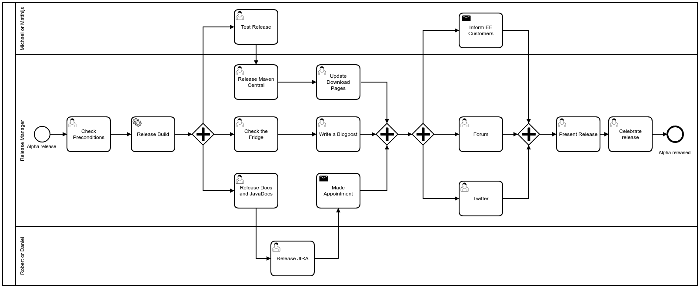

Process:




Steps:
- [ ] [Make calendar appointments](#make-calendar-appointments) (*)
- [ ] [Prepare the blogpost](#prepare-the-blogpost) (*)
- [ ] [Check Preconditions](#check-preconditions) (*)
- [ ] [Trigger the release build](#trigger-the-release-build) (*)
- [ ] [Update the Enterprise Download Page](#update-the-enterprise-download-page) (MS,*)
- [ ] [Test Release](#test-release) (MS, *)
- [ ] [Release Maven Central](#release-maven-central) (*)
- [ ] [Release the documentation (manual)](#release-the-documentation-manual) (*)
- [ ] [Release Javadocs](#release-javadocs) (*)
- [ ] [Release Jira](#release-jira) (*)
- [ ] [Forward Security Reports](#forward-security-reports) (*)
- [ ] [Update the Community Download Page](#update-the-community-download-page) (*)
- [ ] [Check Docker Images](#check-docker-images) (*)
- [ ] [Release the blogpost](#release-the-blogpost) (TL, *)
- [ ] [Publish the Enterprise Page](#publish-the-enterprise-page) (*)
- [ ] [Inform EE Customers (Mailchimp)](#inform-ee-customer-mailchimp) (IK, MS, TL)
- [ ] [Twitter](#twitter) (*, CM)
- [ ] [Forum Announcement](#forum) (*)
- [ ] [Improve this guide](#improve-this-guide) (*)
- [ ] [Celebrate the release](#celebrate-the-release) (*)

Steps marked with (*) are to be performed by the "Release Manager".
MS = Michael Schöttes
TL = Thorben Lindhauer
IK = Ilias Kourtoudis
CM = Charley Mann

# Make calendar appointments

## Deciding on the release date
Decide upon the exact date for the release day. How to find the release day:
* it is always a Friday, except if the Friday is a holiday, then it's the day before (Thursday) and so on.
* take the last day of the month and find the Friday that is "closest" to that date. Closest means that you have to count the number of days from the last day of the month to the previous/next Friday.
* Ask the optimize and modeler teams if they want to participate in the release presentation

## **Release presentation**
The release presentation is done remotely via Zoom. Create a Zoom meeting for the presentation. Ask Backoffice for a pro account.
> 🕔 set a reminder on that date for the release presentation (~3 pm). Include the Zoom link in the invitation. Audience: alle@camunda.com. Location: none

> 🕔 book a room for the team where we can hold the presentation. Audience: camundabpm@camunda.com Location: Any room with enough space.

## **Blog post contribution camunda BPM 7.9.0-alpha3**
> 🕔  set a reminder in the evening of the day before the code freeze so everyone has their blogpost contribution committed.
> Audience: camundabpm@camunda.com

## **Code Freeze camunda BPM 7.9.0-alpha3**
> 🕔  in the evening of the day before the build will take place until its end.
> Audience: camundabpm@camunda.com

## **Build camunda BPM 7.9.0-alpha3**
> 🕗  as the duration of the build lasts at least two hours, make sure to start it in the evening before the release and keep in mind that it might fail. Make sure you have no other appointments on the day of the release.
> Audience: camundabpm@camunda.com, sre@camunda.com

## **Celebrate camunda BPM 7.9.0-alpha3**
> Please see [Celebrate The Release](https://github.com/camunda/camunda-bpm-platform/wiki/Performing-an-Alpha-Release#celebrate-the-release).

# Prepare the Blogpost

Goal: Prepare a blogpost skeleton on a remote branch, such that your colleagues can contribute their sections.

#### 1. Decide on Content

Select four to five significant new features/fixes to be described in more detail. You can validate the choice with Thorben. Ask your colleagues to contribute sections for the features they have built.

#### 2. Update the 'master' and create a branch 7.9.0-alpha3 on the [blog repository](https://github.com/camunda/blog.camunda.org).

```
git checkout master
git pull origin master
git checkout -b 7.9.0-alpha3
```

#### 3. Create a file 'camunda-bpm-790-alpha3-released.md' at /content/post/2017/07/ and push it to the repo.

It should contain an introduction (feature overview, release notes, download encouragement) and conclusion (feedback encouragement, outlook). You can use the blogpost of the last alpha release as a blueprint.

```
git add /content/post/2017/07/camunda-bpm-790-alpha3-released.md
git commit
git push origin 7.9.0-alpha3
```

# Check Preconditions

- There are no Snapshot dependencies to secondary projects like Spin or Connect ([Release procedure](https://github.com/camunda/camunda-bpm-platform/wiki/Release-secondary-projects)). For that, check [bom](https://github.com/camunda/camunda-bpm-platform/blob/master/bom/pom.xml) for snapshot dependencies (All snapshot dependencies contain the word 'SNAPSHOT' in their name).
- There are no code problems ([check ci](https://hq2.camunda.com/broken) section "Master" and "Release")
- [Release Test Job](https://release.cambpm.camunda.cloud/view/Release-Test/) passed successfully recently
- Send an email to camundabpm@camunda.com:
```
Hey,

please stop pushing to master since we are going to build the alpha release.
```

# Trigger the Release Build

Open the following URL in Jenkins:

https://release.cambpm.camunda.cloud/view/Release-Master/

Click on the "Run" icon. Make sure to set the configuration to something like:

```
DEVELOPMENT_VERSION: 7.9.0-SNAPSHOT
RELEASE_VERSION:     7.9.0-alpha3
PUSH_REMOTE:         true
RELEASE_TYPE:        ALPHA
OVERRIDE_TAG:        false
SKIP_TESTS:          true
SKIP_DEPLOY:         false
BRANCH:              master
```

Click Build.
Wait for the following jobs to turn green before continuing with the next step (check e.g. [here](https://release.cambpm.camunda.cloud/view/Release-Master/builds)):


* 7.9-RELEASE-build-camunda-bpm-tags
* 7.9-RELEASE-build-EE-nightly-tags

Please also check that there are no issues at the jenkins 'Release' build (see [here](https://hq2.camunda.com/broken)).

# Update the Enterprise Download Page

Add the latest release to the following page [`camunda-docs-static/enterprise/content/download.md`](https://github.com/camunda/camunda-docs-static/blob/master/enterprise/content/download.md).

All releases are handled as HUGO page variables in the document header. Add the release in the following format:

```
  branches:
  - branch: "7.9"
    releases:
    - number: "7.9.0-alpha3"
      note: "https://blog.camunda.org/post/2017/07/camunda-bpm-790-alpha3-released/"
      date: "2017.07.31"
```

# Release the Enterprise Page

Commit the changes and build the enterprise page:

```
git commit -m "chore(download): add 7.9.0-alpha3 to download page"

git push origin master
```

> Review your commit on http://stage.docs.camunda.org/enterprise/download/

> Make sure that the link to the release notes works as expected.


# Test Release

For each application server one developer should perform a test. Download the release artifacts from http://stage.docs.camunda.org/enterprise/download/

### Standard Regression Test
1. Download the release artifact from the enterprise download page
2. Combine the platform with a database of choice.
3. Start the platform
    1. Check the server log that no exceptions occur
4. Open Admin
    1. Check if the dashboard and main menu contain the sections 'Users', 'Groups', 'Tenants', 'Authorizations', 'System'
    2. Add a license key to the platform
5. Open Tasklist
    1. Start a new invoice process
    2. Walk through the invoice process step by step
6. Open Cockpit
    1. Use the dashboard search plugin to find all finished invoice instances (There should be at least one)
    2. Go to the runtime instance view of the invoice showcase
    3. Switch to the history view
    4. Migrate all instances from the invoice process version 1 to version 2
    5. Use the dashboard search plugin to find all instances started after a certain date
    6. Cancel these instances by using the batch operations
    7. Select a process instance and go to the process instance view
    8. Perform a process instance modification
    9. Add a variable to the process instance

#### Testing with Spring Boot
Use the spring-boot-example [example webapp ee](https://github.com/camunda/camunda-bpm-examples/tree/master/spring-boot-starter/example-webapp-ee) as test scenario.

Check out compatible versions for the release --> [Spring Boot Version Compatibility](https://docs.camunda.org/manual/develop/user-guide/spring-boot-integration/version-compatibility/).

Change the pom.xml file:
```
<properties>
  <camunda.version>7.11.0-alpha5</camunda.version>
  <spring.boot.version>2.1.4.RELEASE</spring.boot.version>
  <camunda.spring.boot.starter.version>3.3.0-SNAPSHOT</camunda.spring.boot.starter.version>
</properties>
```


Enable Groovy Script Engine if necessary

```
<!-- https://mvnrepository.com/artifact/org.codehaus.groovy/groovy-jsr223 -->
<dependency>
    <groupId>org.codehaus.groovy</groupId>
    <artifactId>groovy-jsr223</artifactId>
    <version>2.4.13</version>
</dependency>
```


### Release Specific Test
According to the implemented feature topics choose some of the new feature to to test them manually.
If you don't know wich fixes are worth the effort use the following rule of thumb:
* Prefer UI features as the test coverage is usually lower compared to backend features. Use different browser for the test.
* Prefer features related to customer support issues as our customers expect that these features are working correctly.

If you are satisfied with the release, send an email to camundabpm@camunda.com:

```
Hey,

the release test passed, you can commit to master again :)

```

# Release Maven Central

> Precondition release tests are passed.

We have several CI jobs which upload artifacts to Maven Central into their staging repository section. In order to make them publicly available, we need to manually close the staging repositories and release the artifacts.

1. Go to [Maven Central](https://oss.sonatype.org/) and login using the credentials found in our [Confluence](https://app.camunda.com/confluence/display/camBPM/Maven+Central+Release)
2. On the left side, click on the 'Staging Repositories' link.
3. After it has been loaded, scroll down to the bottom of the list. You should find the relevant Camunda staging repositories there.
4. Mark each repository you want to release.

    *For Example:*

    >org.camunda.bpm.model:camunda-cmmn-model:7.9.0-alpha3
    >org.camunda.bpm:camunda-bom:7.9.0-alpha3
    >org.camunda.bpm.model:camunda-bpmn-model:7.9.0-alpha3
    >org.camunda.bpm.model:camunda-dmn-model:7.9.0-alpha3
    >org.camunda.bpm.dmn:camunda-engine-dmn-bom:7.9.0-alpha3
    >org.camunda.bpm.model:camunda-xml-model:7.9.0-alpha3
    >org.camunda.bpm.webapp:camunda-webapp:7.9.0-alpha3

5. Click on 'Release' at the menu on top of the list. A window will pop up were you can enter a description but it is not necessary. Activate 'Drop repository after release automatically'. Then proceed.
6. Done.

Hint: It takes about two hours til the artifacts are searchable on Maven Central.

# Release the Documentation (Manual)

As part of an alpha release, the current `master` content needs to be released as `latest` at the [docs repository](https://github.com/camunda/camunda-docs-manual).

#### 1. Tag the docs

```
git checkout master
git pull
git tag -a 7.9.0-alpha3 # the comment should be '7.9.0-alpha3'
git push origin 7.9.0-alpha3
```

#### 2. Release the tag as latest

Set the branch `latest` to the tag

```
git checkout latest
git reset --hard 7.9.0-alpha3
```

Edit the config file on the branch

```diff
--- a/config.yaml
+++ b/config.yaml
@@ -1,5 +1,5 @@
 ---
-baseurl: "/manual/develop/"
+baseurl: "/manual/latest/"
 languageCode: "en-us"
 title: "Camunda BPM documentation"
 theme: "camunda"
@@ -20,7 +20,7 @@ params:
       url: "/enterprise"
   section:
     id: "manual"
-    version: "develop"
+    version: "latest"
     versionAlias: "7.5"
     versions:
       - "latest"
```

#### 3. Run `hugo` and check result

#### 4. Commit changes
```
git commit -a -m "chore(release): release master as latest"
```

#### 5. Force push to latest
```
git push -f origin latest
```

#### 6. Release Stage

* The content will be published to http://stage.docs.camunda.org/manual/latest/

* Make sure, that [this](https://ci.cambpm.camunda.cloud/view/Docs/job/docs/job/camunda-docs-manual-stage%20(latest,%20latest)/) build has already been triggered and successfully passed through.

* Once the release is staged there, release it by triggering the following build:
[camunda docs release](https://ci.cambpm.camunda.cloud/view/Docs/job/docs/job/camunda-docs-release%20(manual-latest)/)

* Now the new content is available in http://docs.camunda.org/manual/latest/

#### 7. Update redirects

**Only do this for alpha1 (ie. the first alpha after a minor release)**

In `camunda-docs-static`, edit the redirects

```diff
--- a/config/live/.htaccess
+++ b/config/live/.htaccess
@@ -12,7 +12,7 @@ RewriteRule ^latest/api-references/java/ /manual/7.3/reference/javadoc/

 # Javadoc
 RewriteRule ^manual/develop/reference/javadoc/$ /javadoc/camunda-bpm-platform/7.12 [R=307,L] # live doesn't have -SNAPSHOT
-RewriteRule ^manual/latest/reference/javadoc/$ /javadoc/camunda-bpm-platform/7.11 [R=307,L]
+RewriteRule ^manual/latest/reference/javadoc/$ /javadoc/camunda-bpm-platform/7.12 [R=307,L]
 RewriteRule ^manual/([^/]+)/reference/javadoc/$ /javadoc/camunda-bpm-platform/$1 [R=307,L]

 # Manual without version
diff --git a/config/stage/.htaccess b/config/stage/.htaccess
index 972f0b6..e35ffde 100644
--- a/config/stage/.htaccess
+++ b/config/stage/.htaccess
@@ -7,7 +7,7 @@ RewriteRule ^latest/api-references/java/ /manual/7.3/reference/javadoc/

 # Javadoc
 RewriteRule ^manual/develop/reference/javadoc/$ /javadoc/camunda-bpm-platform/7.12-SNAPSHOT [R=307,L]
-RewriteRule ^manual/latest/reference/javadoc/$ /javadoc/camunda-bpm-platform/7.11 [R=307,L]
+RewriteRule ^manual/latest/reference/javadoc/$ /javadoc/camunda-bpm-platform/7.12 [R=307,L]
 RewriteRule ^manual/([^/]+)/reference/javadoc/$ /javadoc/camunda-bpm-platform/$1 [R=307,L]

 # Manual without version
```

Commit and push

```bash
git add -A
git commit -m "release 7.12.0-alpha1"
git push origin master
```

# Release Javadocs

The javadocs are staged automatically by the release build at http://stage.docs.camunda.org/javadoc/camunda-bpm-platform/7.9 (adjust the version in the URL)

Verify that the correct javadocs are present.

After that, release the javadocs by triggering the following build:

https://ci.cambpm.camunda.cloud/view/Docs/job/docs/job/camunda-docs-release%20(javadoc-camunda-bpm-platform-7.9)/ (adjust the version in the URL)

# Release JIRA
The goal for releasing the JIRA is to add the version you would like to release to issues which have already been closed as well as bug report issues which won't be included in the release because its status is **not closed**. To achieve this, please make sure that the alpha version you would like to release [already exists](https://app.camunda.com/jira/browse/CAM/?selectedTab=com.atlassian.jira.jira-projects-plugin:versions-panel). If not, ask Michael, Roman or Thorben to create this alpha version in JIRA.

To add the release version to the respective "fixVersion" field of all issues which have already been closed, go to the [issues page](https://app.camunda.com/jira/issues) and make sure that the advanced search is enabled.

Put the following query in the search box:

```
project = CAM AND fixVersion = 7.9.0 AND fixVersion != 7.9.0-alpha3 AND status = Closed AND fixVersion NOT IN(7.9.0-alpha1, 7.9.0-alpha2)
```
Make sure that you have set the right minor version within the query.

1. Click on "Tools -> all .. issue(s)".
2. Select all issues and click on "Next".
3. Select "Edit Issues" and click on "Next".
4. Select "Change Fix Version/s" and make sure that "Add to existing" is selected in the dropdown.
5. Select the version you would like to release.
6. Click on "Next".
7. Click on "Confirm".
8. After the completion of the bulk operation, click on "Acknowledge".

To add the release version to the respective "affectedVersion" field of all the issues which won't be included in the release, use the following query in the search box:

```
project = CAM AND fixVersion = 7.9.0 AND type = "Bug Report" AND status = open
```

The further steps are the same as already mentioned.

If you have any questions feel free to approach Thorben. If Thorben is not available, you can ask Michael and/or Roman.

# Forward Security Reports

Determine all security reports for which fixes have are released and forward them to 1) Thorben 2) Roman. They will then take care of publishing security notices. Find all such issues with the following JIRA query:

```
project = CAM AND fixVersion = <released version> AND type = "Security Report"
```

# Update the Community Download Page

You need to provide the release nodes for the current version. You can find them in Jira:

https://app.camunda.com/jira/secure/BrowseProject.jspa/?selectedTab=com.atlassian.jira.jira-projects-plugin:versions-panel

Select the current version and hit the 'release notes' tab and provide the coresponding link.

You can try first to push your changes to [master](https://github.com/camunda/camunda.com-new/blob/master/data/releases.json) and check your change on [stage](https://app.camunda.com/jenkins/view/All/job/stage.camunda.com-new%20(master)/).

Note: "showAlpha": true when releasing alpha

Or you can push directly on live (keep in mind that everyone can see it after that). You need to update the following file:
https://github.com/camunda/camunda.com-new/blob/live/data/releases.json
(Similar to this [commit](https://github.com/camunda/camunda.com-new/commit/f5fd96375a38f34d521a0f4278233be47e5aaca1))

Your push will trigger automatically a Jenkins job here:
https://app.camunda.com/jenkins/view/All/job/camunda.com-new%20(live)/
If everything is ok with it, you check your change under downloads page.

In case you don't have permissions for this repository please ask SRE for help.

# Check Docker Images

Verify that the docker images [CE](https://hub.docker.com/r/camunda/camunda-bpm-platform/) and [EE](https://docs.camunda.org/manual/latest/installation/docker/#enterprise-edition) are built.

* CE job successfully run - https://ci.cambpm.camunda.cloud/job/7.11/job/7.11-platform-docker-ce/
* EE job successfully run - https://ci.cambpm.camunda.cloud/job/7.11/job/7.11-platform-docker-ee/


# Release the Blogpost


#### 1. Update the release notes link

Update the link to the release notes in the blogpost's introduction. To generate it, go to [this page](https://app.camunda.com/jira/secure/ReleaseNote.jspa), select the version you would like to release, set the format to "html" and click on "Create". Ask Thorben if you do not have permissions to perform this step.

#### 2. Ensure that everyone has contributed their content.

#### 3. Proofread the paragraphs and check for potential enterprise features.

All enterprise features need to have a disclaimer like
```
> Please bear in mind that this feature is only available in the Enterprise Edition of the Camunda BPM platform. To try it out anyway, please request a [Free Trial or Quote](https://camunda.com/enterprise/)
```

#### 4. Squash all the commits to one single commit

```
git rebase -i master
```

Replace all 'pick' words with 's' except the first one, e.g.:

```
pick fda59df commit 1
s x536897 commit 2
s c01a668 commit 3
```

#### 5. Before you publish it ensure that the camunda.com download page is up to date.

Note: The title of the blogpost must be in the following format: Camunda BPM 7.9.0-alpha3 Released

#### 6. Publish the blog post by merging the branch with the master:

```
git checkout master
git merge 7.9.0-alpha3
```

#### 7. Check if everything worked out just fine at the [blog page](https://blog.camunda.org/).

# Publish the Enterprise Page

Release the Enterprise documentation by triggering the following build:
https://ci.cambpm.camunda.cloud/view/Docs/job/docs/job/camunda-docs-release%20(enterprise)/

# Inform EE Customer (Mailchimp)

Notify Ilias Kourtoudis, that a new alpha has been released.

Find a detailed instruction in confluence how to publish an enterprise release notification: https://app.camunda.com/confluence/display/camBPM/Publish+an+Enterprise+Release+Notification+on+Mailchimp

# Twitter

Let Charley know that a new release is available by sending her the following email (Please **CC Daniel**):

```
Hi Charley,

we have published a new alpha release:

* The version is 7.9.0-alpha3.
* The link to the blogpost is https://blog.camunda.org/post/2017/07/camunda-bpm-790-alpha3-released
* The most noteworthy thing about this release is "Support for BPMN Conditional Events"
* We propose to include the following image (XX Link) in the tweet.

Best,
XX
```
(Also See: https://app.camunda.com/confluence/display/MAR/Internal+Social+Media+Posting+Process)

If you get an out of office reply, tweet yourself by logging into the Camunda BPM Twitter account.


# Forum

Announce the release in https://forum.camunda.org by posting in the Announcements category linking to the blogpost (adapt elements in bold):

> Title: Camunda BPM **7.9.0-alpha3** released
> Category: Announcements
> Text:
> Hi all,
>
> Camunda BPM **7.9.0-alpha3** has been released today.
> Read all about it on our blog: **https://blog.camunda.org/post/2017/07/camunda-bpm-790-alpha3-released/**.

# Improve this Guide

If you noticed any errors in the guides, any steps that were left out, please edit this document and keep it up to date.

Note: For the version numbers used here it is ok to leave older versions in.

# Present and Celebrate the Release

In the afternoon, present the release remotely via Zoom. If you like you can moderate the presentation. If you prefer someone else do it (which is perfectly fine), please ask Thorben. All presenters should be present and be able to actively participate in a Zoom conference.

## Requirements

* post the blog post till then
* talk **before** with the people who should present the new features
* ask those people to set up demos on their machines that they can share on screen
